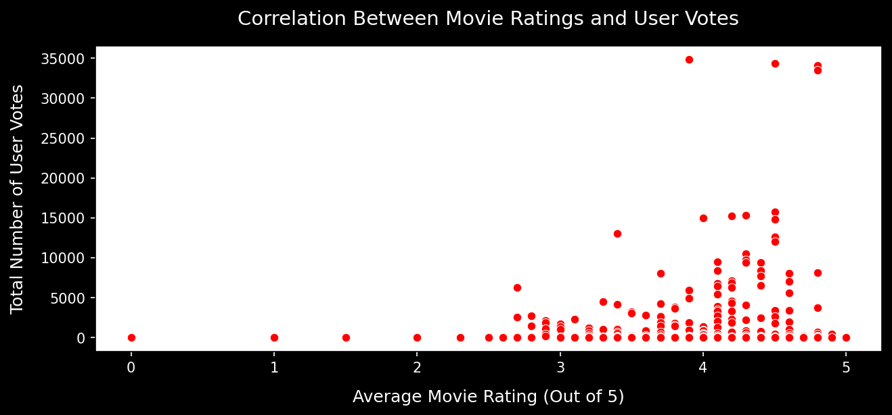
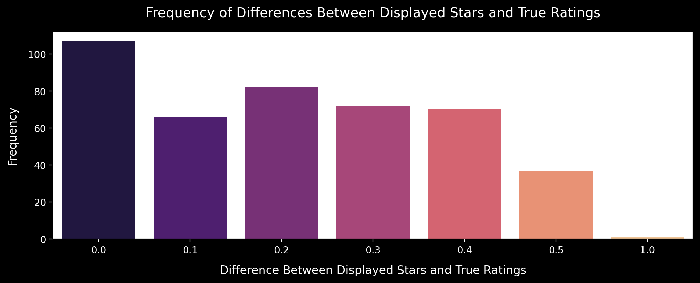
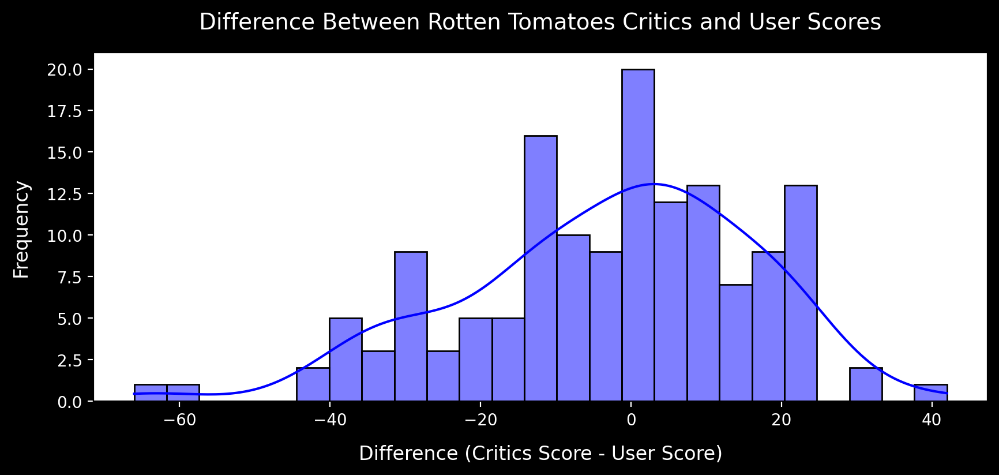
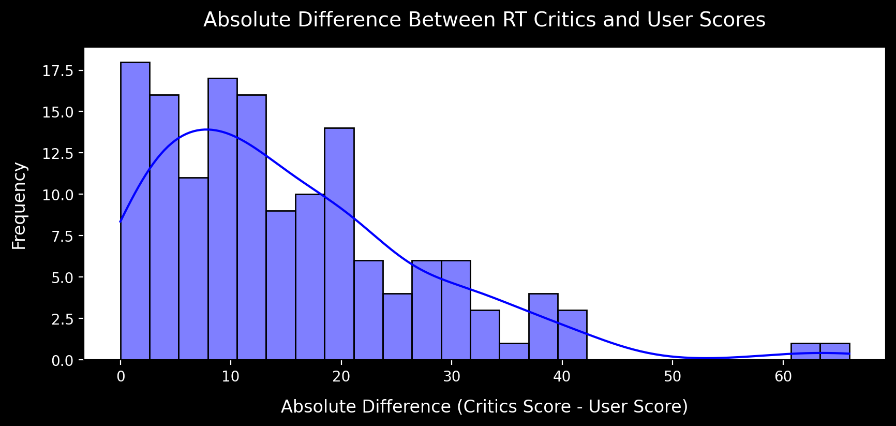
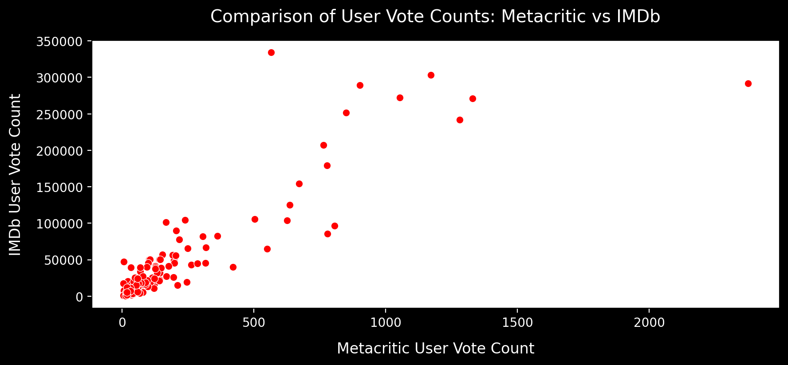
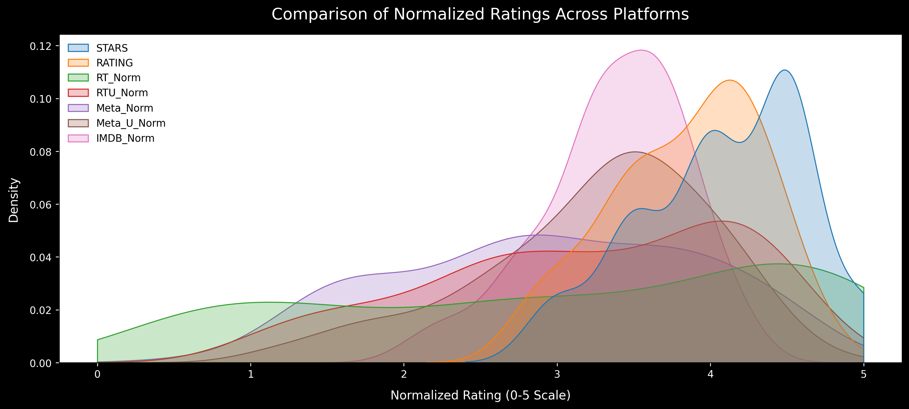

# Fandango Bias Analysis

This project investigates potential rating bias in Fandango's displayed movie ratings by comparing them with actual user ratings and reviews from other platforms (Rotten Tomatoes, Metacritic, and IMDb).

## Overview

Have you ever wondered whether online movie ratings truly reflect user opinions? Especially when the platform showcasing the ratings might have a financial incentive to inflate them? This project delves into Fandango's 2015 movie ratings to uncover potential biases and discrepancies, providing a data-driven perspective on this important question.

## Key Features

- **Data Analysis**: Utilised Python and pandas for data processing and analysis.
- **Visualisation**: Created insightful plots with matplotlib and seaborn to highlight differences.
- **Comparison**: Normalised ratings from multiple platforms for a fair comparison.

## Tools and Libraries

- Python
- pandas
- numpy
- matplotlib
- seaborn

## Data Sources

The data for this project comes from [FiveThirtyEight's GitHub repository](https://github.com/fivethirtyeight/data) and includes:
- `fandango_scrape.csv`
- `all_sites_scores.csv`

## Visualisations

### Scatterplot: Ratings vs Votes
  
*Shows the relationship between Fandango movie ratings and their vote counts.*

### Distribution of Rating Differences
  
*Comparison of Fandango's displayed stars versus actual ratings.*

### Count Plot: Occurrence of Rating Differences
  
*Displays the number of occurrences of specific rating differences between displayed stars and actual ratings.*

### Rotten Tomatoes Critics vs User Ratings
  
*Displays the correlation between Rotten Tomatoes Critics' scores and User scores.*

### Distribution of Critics vs User Score Differences
  
*Visualises the distribution of differences between Rotten Tomatoes Critics and User scores.*

### Distribution of Absolute Differences: RT Critics vs Users
  
*Shows the distribution of absolute differences between Rotten Tomatoes Critics and User scores.*

### Scatterplot: MetaCritic vs IMDb Votes
  
*Shows the relationship between MetaCritic user votes and IMDb user votes.*

### Distribution of Normalized Ratings Across Platforms
  
*Shows the distribution of normalized ratings (0-5 stars) across platforms, allowing for a fair comparison of rating trends.*

## Observations

1. **Fandango Bias:** The data suggests Fandango inflates its ratings compared to other platforms.
2. **Vote Count Trends:** IMDb and Metacritic show consistent rating behaviour across vote counts, while Fandango's ratings are often disconnected from vote counts.
3. **Distribution Differences:** Fandango's rating distribution shows significant skewness compared to other platforms.
